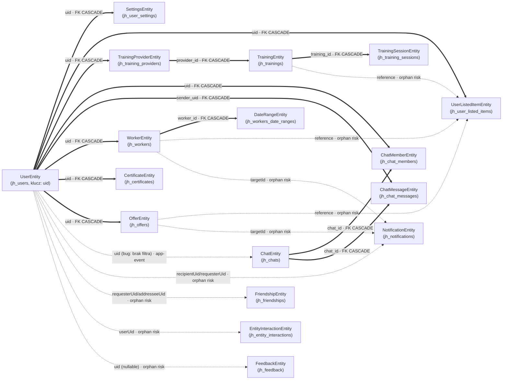

# Drzewo zależności między encjami

Dokument opisuje, jakie encje zależą od siebie oraz co dzieje się z encjami zależnymi, gdy encja
nadrzędna zostaje usunięta. Źródła: dekoratory TypeORM w `backend/src/**/model/*Entity.ts`,
skrypty `db/init/03_create_tables.sql`, `db/migrations/*.sql` oraz logika kaskadowa w serwisach
(subskrypcje RxJS na `userDeletedEvent` itp.).

## Legenda

| Symbol na diagramie | Typ relacji | Co to oznacza |
|---|---|---|
| `──▶` (linia ciągła) | **FK CASCADE (DB)** | Prawdziwy klucz obcy w bazie z `ON DELETE CASCADE`. Usunięcie rodzica **zawsze** kasuje dziecko, niezależnie od kodu aplikacji. |
| `┄┄▶` (linia przerywana, "app-event") | **Kaskada aplikacyjna** | Brak FK w bazie. Usunięcie rodzica emituje zdarzenie (RxJS `Subject`), na które inny serwis reaguje i ręcznie kasuje powiązane rekordy. |
| `┄┄▶` (linia przerywana, "orphan risk") | **Referencja miękka bez kaskady** | Kolumna trzyma tylko `uid`/id jako zwykły `VARCHAR`, bez FK i bez obsługi w kodzie. Po usunięciu rodzica rekordy **zostają osierocone** (potencjalny dług/bug). |

## Diagram

## Szczegóły relacji (per encja nadrzędna)

### UserEntity (`jh_users`, klucz logiczny: `uid`)

| Encja zależna | Pole | Mechanizm | Zachowanie przy usunięciu Usera |
|---|---|---|---|
| SettingsEntity | `uid` | FK CASCADE (`fk_settings_user`) | Usuwane automatycznie przez bazę |
| UserListedItemEntity | `uid` | FK CASCADE (`fk_user_listed_items_user`) | Usuwane automatycznie przez bazę |
| TrainingProviderEntity | `uid` | FK CASCADE, `UNIQUE` | Usuwane automatycznie; **kaskaduje dalej** do Training → TrainingSession |
| TrainingEntity | `uid` | FK CASCADE (dodatkowy, równoległy do relacji przez Provider) | Usuwane automatycznie |
| ChatMemberEntity | `uid` | FK CASCADE | Usuwane automatycznie |
| ChatMessageEntity | `sender_uid` | FK CASCADE | Usuwane automatycznie |
| WorkerEntity | `uid` (`@ManyToOne` → `UserEntity`, `onDelete: 'CASCADE'`) | FK CASCADE (`fk_workers_uid` po `synchronize`) | Usuwane automatycznie przez bazę |
| CertificateEntity | `uid` (`@ManyToOne` → `UserEntity`, `onDelete: 'CASCADE'`) | FK CASCADE (`fk_certificates_uid` po `synchronize`) | Usuwane automatycznie przez bazę, niezależnie od `WorkerEntity` (obie relacje wskazują bezpośrednio na `UserEntity.uid`) |
| OfferEntity | `uid` (`@ManyToOne` → `UserEntity`, `onDelete: 'CASCADE'`) | FK CASCADE (`fk_offers_uid` po `synchronize`) | Usuwane automatycznie przez bazę |
| ChatEntity | — (przez `ChatMemberEntity.uid`) | Kaskada aplikacyjna: `UserService.userDeletedEvent` → `ChatService` | ⚠️ **Podejrzenie buga**: `ChatRepo.getUserChatsWithoutJoins(uid)` nie filtruje po `uid` (parametr jest nieużywany w query builderze) — przy usuwaniu jednego usera efektywnie kasowane są **wszystkie** czaty w systemie. Wymaga weryfikacji/poprawki. |
| NotificationEntity | `recipientUid`, `requesterUid` (bez FK) | **Brak kaskady** | Powiadomienia usuniętego usera oraz te, w których był `requester`, zostają w bazie jako osierocone |
| FriendshipEntity | `requesterUid`, `addresseeUid` (bez FK) | **Brak kaskady** | Rekordy znajomości pozostają osierocone |
| EntityInteractionEntity | `userUid` (bez FK) | **Brak kaskady** | Historia interakcji (views itp.) pozostaje — może być zamierzone (dane analityczne) |
| FeedbackEntity | `uid` (nullable, bez FK) | **Brak kaskady** | Zamierzone — feedback ma być zachowany nawet po usunięciu konta (pole `uid` jest opcjonalne) |

Dodatkowo: `AuthService` (Firebase) i `UserManagementService` (Cloudinary — kasowanie assetów) też
subskrybują `userDeletedEvent`, ale nie dotyczą encji z bazy Postgres.

### WorkerEntity (`jh_workers`, klucz: `worker_id`, referencja logiczna: `uid`)

| Encja zależna | Pole | Mechanizm | Uwagi |
|---|---|---|---|
| DateRangeEntity | `worker_id` (`@ManyToOne` + `@JoinColumn`, `onDelete: 'CASCADE'`) | FK CASCADE | Realna relacja TypeORM, kasowana też z `cascade: true` przy zapisie |
| `jh_worker_search_appearances` (tabela bez encji TypeORM) | `worker_id` | FK CASCADE | Deduplikacja wyświetleń w wyszukiwarce |
| UserListedItemEntity | `reference` (+ `referenceType='WORKER'`, bez FK) | **Brak kaskady** | Ulubieni pracownicy pozostają na liście usera po usunięciu profilu (orphan) |
| NotificationEntity | `targetId` (bez FK, polimorficzne) | **Brak kaskady** | Powiadomienie może wskazywać na nieistniejącego workera |

### ChatEntity (`jh_chats`, klucz: `chat_id`)

| Encja zależna | Pole | Mechanizm |
|---|---|---|
| ChatMemberEntity | `chat_id` (`@ManyToOne` + `@JoinColumn`, `onDelete: 'CASCADE'`) | FK CASCADE |
| ChatMessageEntity | `chat_id` (`@ManyToOne` + `@JoinColumn`, `onDelete: 'CASCADE'`) | FK CASCADE |

`ChatEntity.blockedByUid` to miękka referencja do Usera — bez kaskady (informacja o blokadzie, nie
wymaga czyszczenia).

### TrainingProviderEntity (`jh_training_providers`, klucz: `provider_id`, `uid` unikalny)

| Encja zależna | Pole | Mechanizm |
|---|---|---|
| TrainingEntity | `provider_id` (`REFERENCES ... ON DELETE CASCADE` w SQL, brak `@ManyToOne` w encji TypeORM) | FK CASCADE — realizowana wyłącznie na poziomie bazy, nie widać jej w kodzie TS |

### TrainingEntity (`jh_trainings`, klucz: `training_id`)

| Encja zależna | Pole | Mechanizm |
|---|---|---|
| TrainingSessionEntity | `training_id` (`REFERENCES ... ON DELETE CASCADE` w SQL) | FK CASCADE (dodatkowo `TrainingService.deleteTraining` explicite kasuje sesje przed treningiem — redundantne, ale nieszkodliwe) |
| UserListedItemEntity | `reference` (+ `referenceType='TRAINING'`, bez FK) | **Brak kaskady** — orphan risk |

### OfferEntity (`jh_offers`, klucz: `offer_id`, referencja logiczna: `uid`)

Brak encji zależnych z realną relacją. Powiązania miękkie: `UserListedItemEntity.reference` i
`NotificationEntity.targetId` mogą wskazywać na ofertę — żadne z nich nie jest czyszczone przy
usunięciu oferty (`OffersService.deleteOfferFn` kasuje tylko wiersz oferty).

**Cloudinary (`avatarRef`)**: pokryte dwoma niezależnymi mechanizmami:
- Upload avatara (`OfferFormStepThree.tsx`) jest tagowany m.in. `CloudinaryTags.uid(uid)`, więc
  ogólne czyszczenie assetów usera (`UserManagementService.deleteAllAssetsForUid`, uruchamiane na
  `userDeletedEvent`) usuwa też avatary jego ofert.
- `OffersService.deleteOfferFn` dodatkowo jawnie kasuje assety po tagu `CloudinaryTags.offerId(offerId)`
  (try/catch — błąd Cloudinary nie blokuje usunięcia wiersza), co pokrywa usunięcie pojedynczej
  oferty bez usuwania konta.

## Encje bez zależności (liście drzewa)

`CertificateEntity`, `DateRangeEntity`, `ChatMemberEntity`, `ChatMessageEntity`,
`TrainingSessionEntity`, `NotificationEntity`, `FriendshipEntity`, `EntityInteractionEntity`,
`SettingsEntity`, `UserListedItemEntity`, `FeedbackEntity`, `DictionaryEntity`,
`TranslationEntity` — nic od nich nie zależy.

## Znane luki / do weryfikacji

1. **`ChatRepo.getUserChatsWithoutJoins(uid)`** nie filtruje po `uid` — usunięcie dowolnego usera
   kasuje wszystkie czaty w systemie zamiast tylko czatów usuwanego usera.
2. **Brak kaskady** dla `NotificationEntity`, `FriendshipEntity`, `EntityInteractionEntity` przy
   usunięciu Usera — do decyzji, czy to zamierzone (dane historyczne) czy dług techniczny.
3. **`UserListedItemEntity.reference`** (ulubione: oferty/pracownicy/szkolenia) i
   **`NotificationEntity.targetId`** to referencje polimorficzne bez żadnego czyszczenia przy
   usunięciu encji docelowej — mogą prowadzić do "martwych" wpisów w UI.

## Historia zmian

- `WorkerEntity` i `CertificateEntity` zostały przepięte z kaskady aplikacyjnej (RxJS
  `userDeletedEvent`) na prawdziwy FK `ON DELETE CASCADE` (`@ManyToOne` → `UserEntity`, po `uid`).
  Wymaga czystej bazy (brak osieroconych wierszy) przy pierwszym `synchronize` — do tego służy
  endpoint `GET /api/super-admin/:password/nuke`. Usunięto tym samym niespójność
  `WorkerRepo.deleteAllProfiles()` vs `deleteProfile`/`deleteProfileByUid` w zakresie czyszczenia
  certyfikatów — teraz to zawsze robi baza.
- `OfferEntity` przepięta analogicznie: `@ManyToOne` → `UserEntity` z `onDelete: 'CASCADE'`,
  usunięta manualna subskrypcja `userDeletedEvent` w `OffersService`.
- Domknięty dług dot. Cloudinary dla `OfferEntity.avatarRef`: frontend (`OfferFormStepThree.tsx`)
  dodaje tag `CloudinaryTags.uid(uid)` do uploadu avatara oferty, a `OffersService.deleteOfferFn`
  (po wstrzyknięciu `CloudinaryService` przez `UserManagementModule` w `OfferModule`) jawnie kasuje
  assety po tagu `offerId` przy usunięciu pojedynczej oferty.
