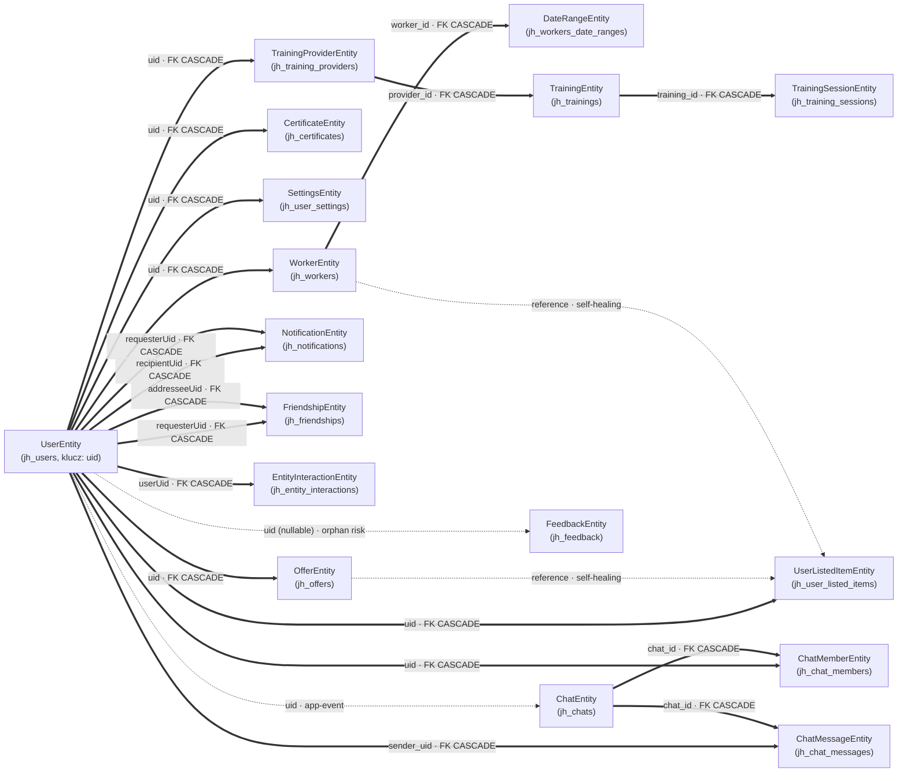

# Drzewo zależności między encjami

Dokument opisuje, jakie encje zależą od siebie oraz co dzieje się z encjami zależnymi, gdy encja
nadrzędna zostaje usunięta. Źródła: dekoratory TypeORM w `backend/src/**/model/*Entity.ts`,
skrypty `db/init/03_create_tables.sql`, `db/migrations/*.sql` oraz logika kaskadowa w serwisach
(subskrypcje RxJS na `userDeletedEvent`/`registerPreDeleteHook` itp.).

## Legenda

| Symbol na diagramie | Typ relacji | Co to oznacza |
|---|---|---|
| `──▶` (linia ciągła) | **FK CASCADE (DB)** | Prawdziwy klucz obcy w bazie z `ON DELETE CASCADE`. Usunięcie rodzica **zawsze** kasuje dziecko, niezależnie od kodu aplikacji. |
| `┄┄▶` (linia przerywana, "app-event") | **Kaskada aplikacyjna** | Brak FK w bazie. Usunięcie rodzica emituje zdarzenie (RxJS `Subject`), na które inny serwis reaguje i ręcznie kasuje powiązane rekordy. |
| `┄┄▶` (linia przerywana, "orphan risk") | **Referencja miękka bez kaskady** | Kolumna trzyma tylko `uid`/id jako zwykły `VARCHAR`, bez FK i bez obsługi w kodzie. Po usunięciu rodzica rekordy **zostają osierocone** (potencjalny dług/bug). |
| `┄┄▶` (linia przerywana, "self-healing") | **Referencja miękka z leniwym czyszczeniem w aplikacji** | Kolumna trzyma tylko id jako `VARCHAR`, bez FK, ale kod aplikacji przy każdym odczycie danych filtruje i kasuje wiersze wskazujące na nieistniejący już target — osierocony wpis nigdy nie jest widoczny w UI. |

## Diagram

## Szczegóły relacji (per encja nadrzędna)

### UserEntity (`jh_users`, klucz logiczny: `uid`)

| Encja zależna | Pole | Mechanizm | Zachowanie przy usunięciu Usera |
|---|---|---|---|
| SettingsEntity | `uid` | FK CASCADE (`fk_settings_user`) | Usuwane automatycznie przez bazę |
| UserListedItemEntity | `uid` | FK CASCADE (`fk_user_listed_items_user`) | Usuwane automatycznie przez bazę |
| TrainingProviderEntity | `uid` | FK CASCADE, `UNIQUE` | Usuwane automatycznie; **kaskaduje dalej** do Training → TrainingSession |
| TrainingEntity | `uid` | FK CASCADE (dodatkowy, równoległy do relacji przez Provider) | Usuwane automatycznie |
| ChatMemberEntity | `uid` | FK CASCADE | Usuwane automatycznie |
| ChatMessageEntity | `sender_uid` | FK CASCADE | Usuwane automatycznie |
| WorkerEntity | `uid` (`@ManyToOne` → `UserEntity`, `onDelete: 'CASCADE'`) | FK CASCADE (`fk_workers_uid` po `synchronize`) | Usuwane automatycznie przez bazę |
| CertificateEntity | `uid` (`@ManyToOne` → `UserEntity`, `onDelete: 'CASCADE'`) | FK CASCADE (`fk_certificates_uid` po `synchronize`) | Usuwane automatycznie przez bazę, niezależnie od `WorkerEntity` (obie relacje wskazują bezpośrednio na `UserEntity.uid`) |
| OfferEntity | `uid` (`@ManyToOne` → `UserEntity`, `onDelete: 'CASCADE'`) | FK CASCADE (`fk_offers_uid` po `synchronize`) | Usuwane automatycznie przez bazę |
| ChatEntity | — (przez `ChatMemberEntity.uid`) | Kaskada aplikacyjna: **pre-delete hook** (`UserService.registerPreDeleteHook` → `ChatService`) | `ChatRepo.getUserChatsWithoutJoins(uid)` filtruje po `uid` przez `innerJoin('chat.members', ...)` — wykonywane **przed** fizycznym `DELETE` usera (patrz niżej "Pre-delete hooks vs. `userDeletedEvent`"), bo FK `ChatMemberEntity.uid → CASCADE` jest `NOT DEFERRABLE` i kasuje wiersze `jh_chat_members` synchronicznie w tym samym statemencie. Pozostałym uczestnikom wysyłany jest `ChatEvents.CHAT_DELETED` przez `SocketGateway.emitToRoom` |
| NotificationEntity | `recipientUid`, `requesterUid` (obie `@ManyToOne` → `UserEntity`, `onDelete: 'CASCADE'`) | FK CASCADE (`fk_notifications_recipient_uid`, `fk_notifications_requester_uid` po `synchronize`) + **pre-delete hook** (`NotificationService`) | Usuwane automatycznie przez bazę — zarówno powiadomienia usuniętego odbiorcy, jak i te, w których był `requester`. Dodatkowo dla powiadomień, gdzie usuwany user był `requester` (a nie odbiorcą), hook emituje `NotificationEvents.NOTIFICATION_DELETED` do odbiorcy przed fizycznym skasowaniem — bez tego frontend nie dowiedziałby się o zniknięciu wpisu (np. "X zaakceptował zaproszenie") aż do odświeżenia listy |
| FriendshipEntity | `requesterUid`, `addresseeUid` (obie `@ManyToOne` → `UserEntity`, `onDelete: 'CASCADE'`) | FK CASCADE (`fk_friendships_requester_uid`, `fk_friendships_addressee_uid` po `synchronize`) + **pre-delete hook** (`FriendshipService`) | Usuwane automatycznie przez bazę — zarówno znajomości, gdzie usuwany user był requesterem, jak i addressee. Hook przed skasowaniem usera odczytuje jego znajomości/zaproszenia i emituje `FriendshipEvents.FRIEND_REMOVED` do drugiej strony — bez tego jej lista znajomych pokazywałaby "martwy" wpis aż do odświeżenia |
| EntityInteractionEntity | `userUid` (`@ManyToOne` → `UserEntity`, `onDelete: 'CASCADE'`) | FK CASCADE (`fk_entity_interactions_user_uid` po `synchronize`) | Usuwane automatycznie przez bazę. Bez pre-delete hooka/socketu — to prywatna historia interakcji (własne wyświetlenia) usuwanego usera, nie ma drugiej strony, którą trzeba by powiadomić |
| FeedbackEntity | `uid` (nullable, bez FK) | **Brak kaskady** | Zamierzone — feedback ma być zachowany nawet po usunięciu konta (pole `uid` jest opcjonalne) |

Dodatkowo: `AuthService` (Firebase) i `UserManagementService` (Cloudinary — kasowanie assetów) też
subskrybują `userDeletedEvent`, ale nie dotyczą encji z bazy Postgres.

#### Pre-delete hooks vs. `userDeletedEvent`

`UserRepo.deleteEntity` wykonuje pojedynczy `DELETE FROM jh_users WHERE uid = ...`. Ponieważ FK-i
`ON DELETE CASCADE` (np. `ChatMemberEntity.uid`) są domyślnie `NOT DEFERRABLE`, Postgres kasuje
zależne wiersze **w ramach tego samego statementu** — zanim jeszcze `await` w `UserService.deleteUser`
się rozwiąże. `userDeletedEvent` jest emitowany **po** tym fakcie, więc każdy handler, który
próbowałby w nim odpytać bazę o rekordy powiązane z usuniętym userem **przez FK CASCADE** (np.
`innerJoin('chat.members', ...)`), zawsze trafi na pustkę.

Dlatego `UserService` udostępnia też `registerPreDeleteHook(hook)` — hooki rejestrowane tą metodą są
wykonywane sekwencyjnie **przed** `userRepo.deleteEntity`, gdy powiązane wiersze jeszcze istnieją.
`ChatService.onModuleInit` rejestruje w ten sposób hook, który zbiera `chatId`-y usera, kasuje te
czaty (`chatRepo.deleteChat`) i powiadamia pozostałych uczestników przez `ChatEvents.CHAT_DELETED`
(`SocketGateway.emitToRoom`), zanim jeszcze wiersz usera zniknie z bazy.

Analogicznie `NotificationService.onModuleInit` rejestruje hook, który przed skasowaniem usera
odczytuje notyfikacje, w których był `requesterUid` (te zostaną zaraz skasowane przez FK CASCADE),
i dla każdej z nich (jeśli odbiorca to ktoś inny) emituje `NotificationEvents.NOTIFICATION_DELETED`
do odbiorcy (`SocketGateway.emitToUser`) — inaczej UI odbiorcy pokazywałby "martwą" notyfikację aż
do ręcznego odświeżenia.

Analogicznie `FriendshipService.onModuleInit` rejestruje hook, który przed skasowaniem usera
odczytuje jego znajomości/zaproszenia (`friendshipRepo.findFriendsByUid`, te zostaną zaraz skasowane
przez FK CASCADE na `requesterUid`/`addresseeUid`) i dla każdej z nich emituje
`FriendshipEvents.FRIEND_REMOVED` do obu stron (`FriendshipSocketHandler.notifyFriendRemoved` →
`SocketGateway.emitToUser`) — druga strona (ta, która nie jest kasowana) usuwa wpis ze swojej listy
znajomych na żywo zamiast dopiero po odświeżeniu.

Zasada: **`userDeletedEvent`** — dla logiki niezależnej od DB-relacji usera (Firebase, Cloudinary po
`uid` wprost). **`registerPreDeleteHook`** — dla logiki, która musi odpytać bazę o rekordy powiązane
z userem przez FK, zanim baza je skasuje kaskadowo.

### WorkerEntity (`jh_workers`, klucz: `worker_id`, referencja logiczna: `uid`)

| Encja zależna | Pole | Mechanizm | Uwagi |
|---|---|---|---|
| DateRangeEntity | `worker_id` (`@ManyToOne` + `@JoinColumn`, `onDelete: 'CASCADE'`) | FK CASCADE | Realna relacja TypeORM, kasowana też z `cascade: true` przy zapisie |
| `jh_worker_search_appearances` (tabela bez encji TypeORM) | `worker_id` | FK CASCADE | Deduplikacja wyświetleń w wyszukiwarce |
| UserListedItemEntity | `reference` (+ `referenceType='WORKER'`, bez FK) | **Self-healing (aplikacja)** | Wiersz nie jest kasowany od razu, ale `UserListedItemService.listUserItems` przy każdym odczycie listy ulubionych odfiltrowuje pozycje wskazujące na nieistniejącego workera i kasuje je (`removeItemsWithMissingData`) — usunięty profil nigdy nie jest widoczny w UI |
| NotificationEntity (`WORKER_PROFILE_AVAILABILITY_EXPIRED`) | `targetId` | **Nie dotyczy — brak realnej relacji** | Ta notyfikacja jest generowana efemerycznie w `ExpirationNotificationService` (ujemny pseudo-ID) i nigdy nie jest zapisywana do bazy (`repository.save`) — nie może więc wskazywać na osieroconego workera |

### ChatEntity (`jh_chats`, klucz: `chat_id`)

| Encja zależna | Pole | Mechanizm |
|---|---|---|
| ChatMemberEntity | `chat_id` (`@ManyToOne` + `@JoinColumn`, `onDelete: 'CASCADE'`) | FK CASCADE |
| ChatMessageEntity | `chat_id` (`@ManyToOne` + `@JoinColumn`, `onDelete: 'CASCADE'`) | FK CASCADE |

`ChatEntity.blockedByUid` to miękka referencja do Usera — bez kaskady (informacja o blokadzie, nie
wymaga czyszczenia).

### TrainingProviderEntity (`jh_training_providers`, klucz: `provider_id`, `uid` unikalny)

| Encja zależna | Pole | Mechanizm |
|---|---|---|
| TrainingEntity | `provider_id` (`REFERENCES ... ON DELETE CASCADE` w SQL, brak `@ManyToOne` w encji TypeORM) | FK CASCADE — realizowana wyłącznie na poziomie bazy, nie widać jej w kodzie TS |

### TrainingEntity (`jh_trainings`, klucz: `training_id`)

| Encja zależna | Pole | Mechanizm |
|---|---|---|
| TrainingSessionEntity | `training_id` (`REFERENCES ... ON DELETE CASCADE` w SQL) | FK CASCADE (dodatkowo `TrainingService.deleteTraining` explicite kasuje sesje przed treningiem — redundantne, ale nieszkodliwe) |

`UserListedItemReferenceTypes` (`shared/interfaces/UserListedItem.ts`) obsługuje obecnie tylko
`WORKER` i `OFFER` — wartość `TRAINING` nie istnieje, więc ulubione szkolenia nie są jeszcze
zaimplementowaną funkcją i nie generują żadnego ryzyka osierocenia.

### OfferEntity (`jh_offers`, klucz: `offer_id`, referencja logiczna: `uid`)

Brak encji zależnych z realną relacją. Powiązania miękkie:
- `UserListedItemEntity.reference` (+ `referenceType='OFFER'`) — **self-healing**, tym samym
  mechanizmem co dla `WorkerEntity`: `UserListedItemService.listUserItems` filtruje i kasuje wiersze
  wskazujące na nieistniejącą już ofertę przy każdym odczycie listy ulubionych.
- `NotificationEntity.targetId` (typ `OFFER_EXPIRATION`) — **nie dotyczy**, ta notyfikacja jest
  generowana efemerycznie w `ExpirationNotificationService` i nigdy nie trafia do bazy, więc nie
  może wskazywać na nieistniejącą ofertę.

**Cloudinary (`avatarRef`)**: pokryte dwoma niezależnymi mechanizmami:
- Upload avatara (`OfferFormStepThree.tsx`) jest tagowany m.in. `CloudinaryTags.uid(uid)`, więc
  ogólne czyszczenie assetów usera (`UserManagementService.deleteAllAssetsForUid`, uruchamiane na
  `userDeletedEvent`) usuwa też avatary jego ofert.
- `OffersService.deleteOfferFn` dodatkowo jawnie kasuje assety po tagu `CloudinaryTags.offerId(offerId)`
  (try/catch — błąd Cloudinary nie blokuje usunięcia wiersza), co pokrywa usunięcie pojedynczej
  oferty bez usuwania konta.

## Encje bez zależności (liście drzewa)

`CertificateEntity`, `DateRangeEntity`, `ChatMemberEntity`, `ChatMessageEntity`,
`TrainingSessionEntity`, `NotificationEntity`, `FriendshipEntity`, `EntityInteractionEntity`,
`SettingsEntity`, `UserListedItemEntity`, `FeedbackEntity`, `DictionaryEntity`,
`TranslationEntity` — nic od nich nie zależy.

## Znane luki / do weryfikacji

Brak otwartych pozycji. Wszystkie encje z dawnej listy orphan-risk (`ChatEntity`,
`NotificationEntity`, `FriendshipEntity`, `EntityInteractionEntity`) mają FK CASCADE, a tam gdzie
druga strona musi się dowiedzieć o zmianie na żywo — pre-delete hook z emisją WebSocket.
Polimorficzna referencja `UserListedItemEntity.reference` (`WORKER`/`OFFER`) jest self-healing w
aplikacji (patrz sekcje `WorkerEntity`/`OfferEntity` wyżej). `NotificationEntity.targetId` dla
typów `WORKER_PROFILE_AVAILABILITY_EXPIRED`/`OFFER_EXPIRATION` nigdy nie może osierocieć, bo te
notyfikacje są generowane efemerycznie i nigdy nie trafiają do bazy. Jedyna świadomie
zaakceptowana "luka" to `FeedbackEntity.uid` — zamierzone zachowanie (feedback przeżywa usunięcie
konta).

## Historia zmian

- `WorkerEntity` i `CertificateEntity` zostały przepięte z kaskady aplikacyjnej (RxJS
  `userDeletedEvent`) na prawdziwy FK `ON DELETE CASCADE` (`@ManyToOne` → `UserEntity`, po `uid`).
  Wymaga czystej bazy (brak osieroconych wierszy) przy pierwszym `synchronize` — do tego służy
  endpoint `GET /api/super-admin/:password/nuke`. Usunięto tym samym niespójność
  `WorkerRepo.deleteAllProfiles()` vs `deleteProfile`/`deleteProfileByUid` w zakresie czyszczenia
  certyfikatów — teraz to zawsze robi baza.
- `OfferEntity` przepięta analogicznie: `@ManyToOne` → `UserEntity` z `onDelete: 'CASCADE'`,
  usunięta manualna subskrypcja `userDeletedEvent` w `OffersService`.
- Domknięty dług dot. Cloudinary dla `OfferEntity.avatarRef`: frontend (`OfferFormStepThree.tsx`)
  dodaje tag `CloudinaryTags.uid(uid)` do uploadu avatara oferty, a `OffersService.deleteOfferFn`
  (po wstrzyknięciu `CloudinaryService` przez `UserManagementModule` w `OfferModule`) jawnie kasuje
  assety po tagu `offerId` przy usunięciu pojedynczej oferty.
- Naprawiony bug w `ChatRepo.getUserChatsWithoutJoins(uid)`: metoda nie filtrowała po `uid` (parametr
  był nieużywany w query builderze), przez co usunięcie dowolnego usera kasowało **wszystkie** czaty
  w systemie (subskrypcja `userDeletedEvent` w `ChatService` iteruje po wyniku i wywołuje
  `chatRepo.deleteChat` dla każdego). Naprawa: dodany `innerJoin('chat.members', 'member', 'member.uid = :uid', { uid })`.
- `NotificationEntity` przepięta z "brak kaskady" (miękkie `recipientUid`/`requesterUid` jako
  zwykłe kolumny) na prawdziwe FK `ON DELETE CASCADE`: dodane `@ManyToOne` → `UserEntity` dla obu
  kolumn. Usunięcie usera kasuje teraz automatycznie zarówno powiadomienia, w których był
  odbiorcą, jak i te, w których był `requester` — decyzja świadoma, bo `requesterName`/`avatarRef`
  są już zdenormalizowane w encji, ale uznano, że powiadomienie dotyczące nieistniejącego już
  usera nie ma wartości dla nikogo.
- Naprawiony **timing bug** w usuwaniu czatów przy usunięciu usera: subskrypcja `userDeletedEvent`
  w `ChatService` odpytywała bazę o czaty usera **po** tym jak DB CASCADE (`ChatMemberEntity.uid`)
  już zdążyło skasować jego wiersze `jh_chat_members` (FK `NOT DEFERRABLE` → kaskada synchroniczna
  w ramach tego samego `DELETE`), więc `innerJoin('chat.members', ...)` zawsze zwracał 0 wyników.
  Naprawa: dodany `UserService.registerPreDeleteHook`, wykonywany **przed** `userRepo.deleteEntity`;
  `ChatService` przeniósł tam logikę zbierania/kasowania czatów. Przy okazji dodana emisja
  `ChatEvents.CHAT_DELETED` (`SocketGateway.emitToRoom`) do pozostałych uczestników każdego
  kasowanego czatu — wcześniej nie byli o tym w ogóle informowani przez WebSocket.
- `NotificationService` również zarejestrował pre-delete hook (ten sam problem timingowy co przy
  czatach dotyczy FK CASCADE na `requesterUid`): przed usunięciem usera odczytuje notyfikacje, w
  których był `requesterUid`, i emituje `NotificationEvents.NOTIFICATION_DELETED` do odbiorców
  (`SocketGateway.emitToUser`), żeby ich UI od razu usunął nieaktualny wpis (np. "X zaakceptował
  zaproszenie do znajomych" po usunięciu konta X).
- `FriendshipEntity` przepięta z "brak kaskady" (miękkie `requesterUid`/`addresseeUid` jako zwykłe
  kolumny) na prawdziwe FK `ON DELETE CASCADE`: dodane `@ManyToOne` → `UserEntity` dla obu kolumn.
  `FriendshipService` zarejestrował pre-delete hook (ten sam problem timingowy co przy czatach i
  notyfikacjach — FK CASCADE jest `NOT DEFERRABLE`): przed usunięciem usera odczytuje jego
  znajomości/zaproszenia i emituje `FriendshipEvents.FRIEND_REMOVED` do drugiej strony
  (`FriendshipSocketHandler.notifyFriendRemoved`), żeby jej lista znajomych zaktualizowała się na
  żywo. Przy okazji naprawiony bug we frontendowej obsłudze tego eventu: backend zawsze emitował
  `removedFriendshipId` (`number`), a `FriendsSocketService`/`FriendsProvider` błędnie typowały i
  odczytywały payload jako obiekt `FriendshipI` (`friendship.friendshipId`), przez co filtrowanie
  usuniętej znajomości z listy nigdy realnie nie działało (dotyczyło też zwykłego, ręcznego
  usunięcia znajomego, nie tylko usunięcia konta) — poprawione na `number` po obu stronach.
- `EntityInteractionEntity` przepięta z "brak kaskady" (miękka kolumna `userUid`) na prawdziwe FK
  `ON DELETE CASCADE`: dodane `@ManyToOne` → `UserEntity`. Bez pre-delete hooka i bez emisji
  socketu — w odróżnieniu od Chat/Notification/Friendship, ta encja to prywatna historia
  interakcji (własne wyświetlenia) usuwanego usera; nie ma drugiej strony ani żadnego UI innego
  usera, które trzeba by o tym powiadomić, więc zwykły FK CASCADE w pełni domyka lukę. Domyka to
  ostatni wpis z listy orphan-risk w tym dokumencie.
- Korekta dokumentacyjna sekcji `WorkerEntity`/`OfferEntity`/`TrainingEntity` oraz "Znane luki"
  (bez zmian w kodzie) — dokument opisywał nieaktualny/błędny stan. W rzeczywistości
  `UserListedItemEntity.reference` (dla `WORKER` i `OFFER`) jest już self-healing:
  `UserListedItemService.listUserItems` filtruje i kasuje wiersze wskazujące na nieistniejący już
  target przy każdym odczycie listy ulubionych, więc osierocony wpis nigdy nie jest widoczny w UI.
  `NotificationEntity.targetId` dla `WORKER_PROFILE_AVAILABILITY_EXPIRED`/`OFFER_EXPIRATION` nigdy
  nie może osierocieć, bo te notyfikacje są generowane efemerycznie w
  `ExpirationNotificationService` (ujemny pseudo-ID) i nigdy nie są zapisywane do bazy. Usunięto
  też wpis o `TrainingEntity` → `UserListedItemEntity.reference` z `referenceType='TRAINING'` —
  taka wartość enuma (`UserListedItemReferenceTypes`) w ogóle nie istnieje (obsługiwane są tylko
  `WORKER` i `OFFER`).
